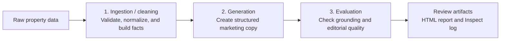

# Grounded Property Listing Content Generator

This project converts raw vacation-rental data into four required marketing outputs: a hero headline, property highlights, an “about this place” section, and amenity descriptions. Its central requirement is factual grounding: the generator may use any subset of the available facts, but every factual statement it produces must be fully supported.

## Reviewer quick start

No API key or new model call is needed to review the submitted result:

```bash
uv sync --locked
open artifacts/live-report.html
```

The report presents all four test properties in the order **raw input → ingestion / cleaning → generation → evaluation**. It is rendered from the committed Inspect AI log.

To inspect the underlying model calls and scores:

```bash
uv run inspect view start --log-dir logs/final
```

Open `http://127.0.0.1:7575` and select the only run. An `.eval` file is an Inspect archive and should not be opened directly.

## Approach

The pipeline has three phases:



### 1. Ingestion / cleaning

This phase validates the input, normalizes source content, and builds the verified fact catalog. Structured inputs become exact facts. The description is cleaned of HTML, split into proposed atomic facts by an LLM, and each proposal is semantically verified against the complete description before it can be used. Conflicting description values are rejected in favor of structured rental data. Unknown amenities, coordinates, identifiers, and image URLs remain available for audit but cannot support marketing claims. Reviews can be used only with explicit guest attribution.

Each fact records its source, status, usage policy, priority, and a stable ID. Only active facts permitted for marketing are sent to generation.

**Ingestion / cleaning example from the committed run**

| Raw input | Fact-catalog result |
|---|---|
| `A bright cottage with a fenced garden.` | `The cottage is bright` and `The property has a fenced garden` are verified, active description facts. |
| `max_guests: 4`, `bedrooms: 2`, `bathrooms: 1` | Exact, high-priority structured facts. |
| Amenity `KitchenAndDining` | Active fact rendered as “Kitchen and dining facilities.” |
| Unknown amenity `SuperFastTeleport` | Preserved with a warning but excluded from generation. |
| Review: `Our children enjoyed the garden.` | Claimable only as an attributed guest observation. |

### 2. Generation

This phase creates the grounded marketing copy. There is one content-generation call per property. The model receives the filtered fact catalog, ordered by marketing priority—not the unrestricted raw property object. The facts constrain what the copy may claim, but the model can select, order, and phrase them as persuasive, guest-facing marketing copy.

The prompt requires:

- all four output fields in schema-constrained JSON;
- a `fact_ids` list on every generated statement;
- no unsupported inferences, views, distances, attractions, image details, or amenity qualifiers;
- explicit attribution for review-derived observations.

Editorial freedom applies to presentation, not invention: unsupported qualities or benefits remain prohibited. Generation uses temperature `0`; enforcement comes from the validation stage that follows.

**Generation example from the committed run**

```json
{
  "hero_headline": {
    "text": "Bright Cottage with Fenced Garden in Sóller",
    "fact_ids": [
      "description.fact.65c278255833",
      "property.type",
      "description.fact.1036527e94a7",
      "location.city"
    ]
  },
  "property_highlights": [
    {
      "text": "Accommodates up to 4 guests in 2 bedrooms and 1 bathroom.",
      "fact_ids": ["rental.max_guests", "rental.bedrooms", "rental.bathrooms"]
    },
    {
      "text": "Guests rated this cottage 4.6 out of 5 across 9 reviews.",
      "fact_ids": ["reviews.average_score", "reviews.count", "property.type"]
    },
    {
      "text": "The property has a fenced garden.",
      "fact_ids": ["description.fact.1036527e94a7"]
    }
  ],
  "about_this_place": [
    {
      "text": "Cottage Verd is located in Sóller, Spain.",
      "fact_ids": ["property.name", "location.city", "location.country"]
    },
    {
      "text": "Check-in is at 4 PM and check-out is at 11 AM.",
      "fact_ids": ["house_rules.check_in", "house_rules.check_out"]
    },
    {
      "text": "A guest review says: Our children enjoyed the garden.",
      "fact_ids": ["review.0"]
    }
  ],
  "amenities_descriptions": [
    {
      "amenity_code": "KitchenAndDining",
      "text": "Kitchen and dining facilities are available.",
      "fact_ids": ["amenity.kitchenanddining"]
    }
  ]
}
```

The customer-facing renderer removes `fact_ids` and joins the about statements without changing the copy. Evaluation retains the citations and statement boundaries.

### 3. Evaluation

This phase requires 100% factual support. The output first passes deterministic validation. Then each generated statement is sent to a semantic grader with only its cited facts. The grader returns `SUPPORTED`, `PARTIAL`, or `UNSUPPORTED`. A property passes grounding only when every statement is `SUPPORTED`; one partial or unsupported statement fails it. Fact coverage is deliberately not scored.

#### Evaluation Criteria

| Evaluation metric | Pass condition |
|---|---|
| `description_fact_support_rate` | Exactly `1.0`: every active description fact is entailed by the original description. |
| `schema_valid` | All four required outputs parse as the strict `ListingContent` schema. |
| `structure_valid` | Headline, highlights, about section, and amenities meet their required counts and word limits. |
| `citation_valid` | Every statement cites existing, active facts permitted for marketing. |
| `numeric_consistency` | Every generated number occurs in at least one cited fact. |
| `conflict_free` | No statement cites an excluded, conflicted, or internal-only fact. |
| `grounded_statement_rate` | Exactly `1.0`: every generated statement is semantically `SUPPORTED` by its cited facts. |

`non_repetitive` is an advisory diagnostic. After grounding passes, `editorial_quality_passed` evaluates specificity, section differentiation, clarity, guest-facing language, and publishability. Quality cannot compensate for failed factual grounding.

**Evaluation example from the committed run**

> Bright Cottage with Fenced Garden in Sóller

The grader sees only the headline and its four cited facts: bright cottage, property type, fenced garden, and Sóller location. Because those facts support every assertion, the verdict is `SUPPORTED`. If the headline added “with sea views,” it would be `PARTIAL` or `UNSUPPORTED` and the property would fail grounding even if the cited IDs were valid.

## Test data and tests

Because production data was not provided, `fixtures/properties.json` contains four synthetic properties: a rich listing, a sparse listing, a structured-versus-description conflict, and an adversarial HTML/prompt-injection case. One case was held out from prompt iteration. The dataset is intentionally a functional test set, not evidence of production-level statistical performance.

Run the test suite without network calls:

```bash
uv run pytest
```

Run the deterministic control pipeline:

```bash
uv run python -m property_content.offline_report
```

This writes `artifacts/offline-summary.json` using fakes and calibrated decisions; it does not replace the recorded live evaluation.

## Run the full pipeline and evaluation

Python 3.13, `uv`, and an Anthropic API key are required. The task configures Anthropic Claude Sonnet 4.5 for both the generator and the separately named grader role, so only the key must be exported.

### Set the API key securely

From the repository root, read the key without displaying it or storing it in shell history:

```bash
read -s "ANTHROPIC_API_KEY?Anthropic API key: "
echo
export ANTHROPIC_API_KEY
```

Optionally confirm that it is set without printing its value:

```bash
[[ -n "$ANTHROPIC_API_KEY" ]] && echo "Key is set"
```

### Jupyter notebook — primary entry point

Launch Jupyter from the same terminal so it inherits the key:

```bash
uv run jupyter lab evals.ipynb
```

Open `evals.ipynb` and select **Run → Run All Cells**. The notebook executes the real **ingestion / cleaning → generation → evaluation** pipeline across all four fixtures, writes a new Inspect archive to `logs/main`, and displays each raw input, fact catalog, generated listing, evaluation metrics, statement-level grounding verdicts, and editorial assessment. This is a live model run and may take several minutes.

### CLI equivalent

Using the same terminal session:

```bash
PYTHONPATH=. uv run inspect eval property_content/inspect_task.py \
  --log-dir logs/main
```

When finished, remove the key from the shell session:

```bash
unset ANTHROPIC_API_KEY
```

Model identifiers and settings are recorded in the resulting Inspect log. API keys and `.env` files are excluded from version control. To regenerate the readable report from the selected committed log:

```bash
uv run python -m property_content.live_report
```

## View and read the submitted output

### Readable report

```bash
open artifacts/live-report.html
```

For each property, expand **Show exact input JSON**, **Show description extraction and ingestion decisions**, **Show exact output JSON**, and **Show statement-by-statement evidence** to trace a claim from source input through its fact IDs to its final verdict.

### Inspect AI log

```bash
uv run inspect view start --log-dir logs/final
```

In Inspect:

1. Select a sample ID. One sample is one complete property, not one fact.
2. Open `pipeline_evaluation` under **Scores**. A value of `1` is a pass; `grounded_statement_rate = 1.0` means every statement was fully supported.
3. Read the score explanation for rejected description facts, deterministic failures, statement-level grounding verdicts, and editorial decisions.
4. Use **Messages/events** only to audit model calls. Each property has one extraction call, one generation call, verification calls for description facts, grounding calls for generated statements, and one editorial assessment.

The selected committed live log is:

```text
logs/final/2026-08-14T13-52-17-00-00_property-content-eval_Qw43aR4DDWr4pzMbh3fU8S.eval
```

All four properties in this run passed description support, schema, structure, citations, numeric consistency, conflict handling, and 100% semantic grounding. Editorial quality passed for 2 of 4 properties; the two failures were section-differentiation issues and remain visible rather than being hidden.

## Use of AI

I used OpenAI Codex to analyze the assignment, propose the architecture, draft and revise code, generate adversarial test ideas, run tests, inspect live outputs, and improve the documentation.

I remained responsible for the design, acceptance criteria, implementation review, calibration examples, and interpretation of the results. AI suggestions were treated as proposals and verified through tests and recorded evaluations. At runtime, language models are used for description extraction, generation, and semantic/editorial grading; these boundaries are injectable and replaced by deterministic fakes in unit tests.

## Scope

This submission focuses on the content and evaluation pipeline. Image URLs are retained but image understanding and hero-image ranking are future work, alongside larger real-world datasets, multilingual evaluation, independent grader models, and human editorial calibration.
